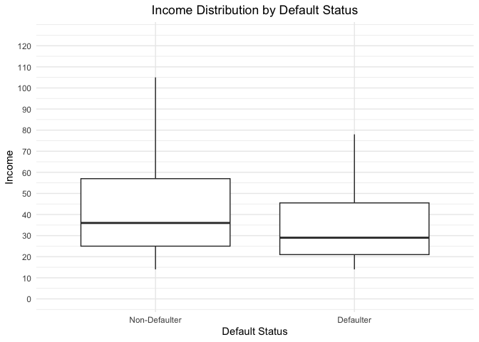
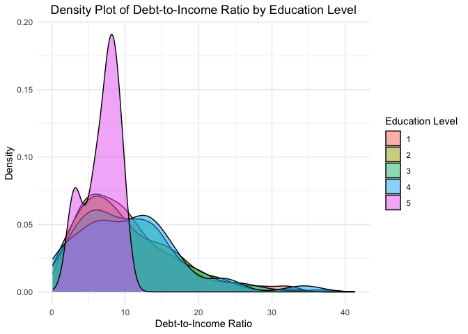
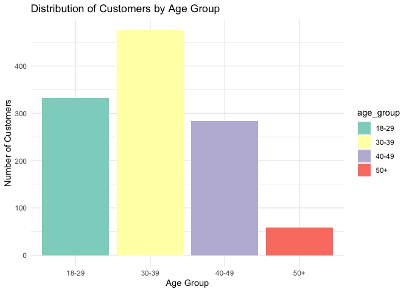
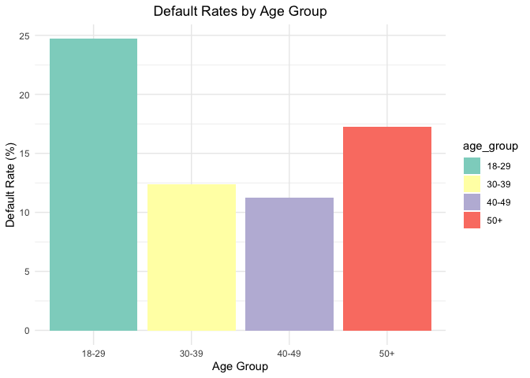
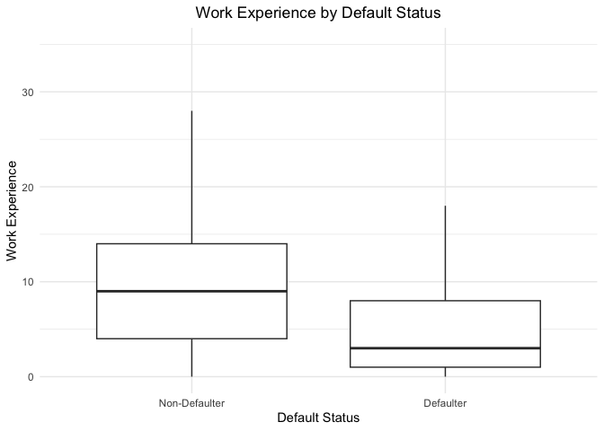
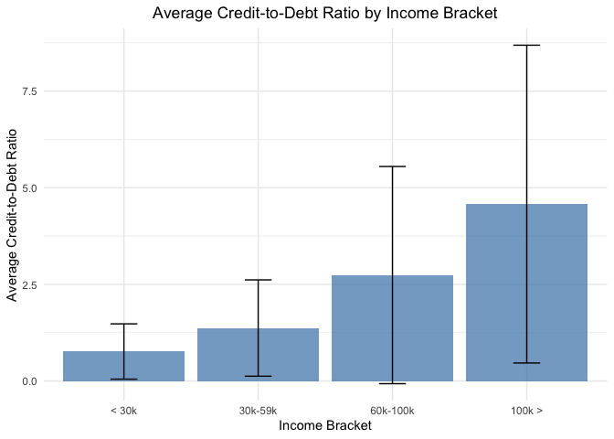

Bank_loans
================
2024-08-07

### QUESTION 1: What is the average income of customers who have defaulted compared to those who have not?

``` r
#Calculate the average income of customers by default status
average_income <- data %>%
  filter(!is.na(default)) %>%
  group_by(default) %>%
  summarise(average_income = mean(income,na.rm = TRUE))

print(average_income)
```

    ## # A tibble: 2 × 2
    ##   default average_income
    ##     <int>          <dbl>
    ## 1       0           47.2
    ## 2       1           41.2

To compare the incomes of customers who default and those who do not, we
conducted both a Welch Two Sample t-test and a Mann-Whitney U test.

T-test for Statistical Significance

``` r
# Perform a t-test to check if the difference in average income is statistically significant
t_test_resultq1 <- t.test(income ~ default, data = data)
print(t_test_resultq1)
```

    ## 
    ##  Welch Two Sample t-test
    ## 
    ## data:  income by default
    ## t = 1.6857, df = 267.52, p-value = 0.09301
    ## alternative hypothesis: true difference in means between group 0 and group 1 is not equal to 0
    ## 95 percent confidence interval:
    ##  -0.9979742 12.8812225
    ## sample estimates:
    ## mean in group 0 mean in group 1 
    ##        47.15474        41.21311

Interpretation: The t-test results indicate that the difference in mean
incomes between defaulters and non-defaulters is not statistically
significant (p-value = 0.09301). However, this test assumes that income
data is normally distributed, which may not be the case. The
Mann-Whitney U test results show a statistically significant difference
(p-value = 0.00005535), suggesting that when considering the ranks of
the incomes, defaulters and non-defaulters do have significantly
different income levels. This test does not assume normality and is more
robust to skewed distributions and outliers.

Graphic representation (Boxplot):

``` r
# Filter out rows where 'default' is NA
filtered_data <- data %>%
  filter(!is.na(default))

ggplot(filtered_data, aes(x = factor(default), y = income)) +
  geom_boxplot(outlier.shape = NA) +
  coord_cartesian(ylim = c(0, 125)) +
  labs(x = "Default Status", y = "Income", title = "Income Distribution by Default Status") +
  scale_x_discrete(labels = c("Non-Defaulter", "Defaulter")) +
  scale_y_continuous(breaks = seq(0, 125, by = 10)) +
  theme_minimal() + 
  theme(plot.title = element_text(hjust = 0.5))
```

<!-- -->

Conclusion: Given that income data is typically not normally distributed
and may be skewed, the Mann-Whitney U test provides a more reliable
analysis. Therefore, the significant result from the Mann-Whitney U test
should be highly considered. This indicates that there is a significant
difference in incomes between defaulters and non-defaulters, with
non-defaulters generally having higher incomes.

### QUESTION 2: How does the debt-to-income ratio vary across different education levels

``` r
# Calculate the average debt-to-income ratio by education level
debt_to_income <- data %>%
  group_by(ed) %>%
  summarise(average_debt_to_income_ratio = mean(debtinc,na.rm = TRUE))

print(debt_to_income)
```

    ## # A tibble: 5 × 2
    ##      ed average_debt_to_income_ratio
    ##   <int>                        <dbl>
    ## 1     1                        10.1 
    ## 2     2                         9.76
    ## 3     3                        10.4 
    ## 4     4                        10.7 
    ## 5     5                         6.86

To investigate how the debt-to-income ratio varies across different
education levels, we will conduct the following analyses:

    1.  ANOVA Test for Statistical Significance
    2.  Post-Hoc Test to Identify Pairwise Differences

ANOVA for Statistical Significance

``` r
# Ensure 'ed' is treated as a factor
data <- data %>%
  mutate(ed = as.factor(ed))

# Perform ANOVA to test if there are significant differences in debt-to-income ratio across education levels
anova_result <- aov(debtinc ~ ed, data = data)
summary(anova_result)
```

    ##               Df Sum Sq Mean Sq F value Pr(>F)
    ## ed             4    118   29.46   0.679  0.607
    ## Residuals   1145  49695   43.40

Interpretation: The ANOVA test shows that the education level (ed) does
not significantly affect the debt-to-income ratio (debtinc) in the
dataset. The F-value is 0.679, and the p-value is 0.607, which is much
greater than the typical significance level of 0.05. This indicates that
there is no statistically significant difference in the debt-to-income
ratio across the different education levels.

Since the ANOVA test did not show significant differences, we proceed
with a post-hoc test to further investigate if there are any specific
pairwise differences between the education levels.

Post-Hoc Test to Identify Pairwise Differences

``` r
# Perform Tukey's HSD post-hoc test
post_hoc_result <- TukeyHSD(anova_result)
print(post_hoc_result)
```

    ##   Tukey multiple comparisons of means
    ##     95% family-wise confidence level
    ## 
    ## Fit: aov(formula = debtinc ~ ed, data = data)
    ## 
    ## $ed
    ##           diff        lwr       upr     p adj
    ## 2-1 -0.3494245  -1.597558 0.8987088 0.9405812
    ## 3-1  0.2603444  -1.477697 1.9983860 0.9941109
    ## 4-1  0.5434649  -1.708724 2.7956538 0.9649048
    ## 5-1 -3.2486478 -11.329707 4.8324117 0.8074498
    ## 3-2  0.6097689  -1.276987 2.4965252 0.9032207
    ## 4-2  0.8928894  -1.475953 3.2617321 0.8415796
    ## 5-2 -2.8992233 -11.013568 5.2151210 0.8659931
    ## 4-3  0.2831204  -2.376648 2.9428888 0.9984393
    ## 5-3 -3.5089922 -11.712987 4.6950028 0.7693577
    ## 5-4 -3.7921127 -12.120204 4.5359784 0.7254511

Interpretation: The Tukey HSD post-hoc test confirms the ANOVA results.
None of the comparisons between different education levels show a
statistically significant difference (all p-values are much greater than
0.05). This further supports that education level does not significantly
influence the debt-to-income ratio.

Density Plot:

``` r
# Density plot
ggplot(data, aes(x = debtinc, fill = ed)) +
  geom_density(alpha = 0.5) +
  labs(
    title = "Density Plot of Debt-to-Income Ratio by Education Level",
    x = "Debt-to-Income Ratio",
    y = "Density"
  ) +
  theme_minimal() +
  theme(plot.title = element_text(hjust = 0.5)) +
  scale_fill_discrete(name = "Education Level")
```

<!-- -->

Key Observation from the graph: There is no clear separation between the
distributions of debt-to-income ratios for different education levels.
This aligns with the statistical analysis which found no significant
difference between the groups. Additionally, most distributions appear
to be right-skewed (longer tail on the right), indicating that while
most individuals have lower debt-to-income ratios, there are a few with
much higher ratios.

Conclusion: Education level does not have a significant impact on the
debt-to-income ratio, as indicated by both the ANOVA and the Tukey HSD
post-hoc test.

### QUESTION 3: What is the distribution of customers by age group and their defaut rates

``` r
# Create age groups
data <- data %>%
  mutate(age_group = case_when(
    age >= 18 & age <= 29 ~ '18-29',
    age >= 30 & age <= 39 ~ '30-39',
    age >= 40 & age <= 49 ~ '40-49',
    age >= 50 ~ '50+',
    TRUE ~ NA_character_
  ))

#Calculate the total customers and default rates by age group
age_distribution <- data %>%
  group_by(age_group) %>%
  summarise(
    total_customers = n(),
    total_defaults = sum(default, na.rm = TRUE),
    default_rate = (sum(default, na.rm = TRUE) / n()) * 100 
  )

print(age_distribution)
```

    ## # A tibble: 4 × 4
    ##   age_group total_customers total_defaults default_rate
    ##   <chr>               <int>          <int>        <dbl>
    ## 1 18-29                 332             82         24.7
    ## 2 30-39                 476             59         12.4
    ## 3 40-49                 284             32         11.3
    ## 4 50+                    58             10         17.2

Major considerations: 1) High Default rate in Younger Age Group (18-29):
The default rate for this category is the highest at 24.70%. This could
indicate that younger individuals are at a higher risk of defaulting on
their loans; this could be caused by the possible lack of financial
stability or lower income. 2) Defaul Rate in Middle Age Groups (30-49):
Both the group of 30-39 and 40-49 have similar and relatively low
default rates of about 12%. These groups may have more stable financial
situations, higher incomes or maybe are more experienced at managing
debt, leading to a lower default rate. 3) Increased Default Rate in
Older Age Group (50+): The default ratio for elderly people is in
between the younger and middle age groups. Some consideration for why
this could be the case may be the approaching retirement maybe causing a
reduction of the income or an increase in medical expenses.

Bar Plots:

``` r
# Bar plot for the distribution of customers by age group
ggplot(age_distribution, aes(x = age_group, y = total_customers, fill = age_group)) +
  geom_bar(stat = "identity") +
  labs(title = "Distribution of Customers by Age Group",
       x = "Age Group",
       y = "Number of Customers") +
  theme_minimal() +
  scale_fill_brewer(palette = "Set3")
```

<!-- -->

``` r
# Bar plot for default rates by age group
ggplot(age_distribution, aes(x = age_group, y = default_rate, fill = age_group)) +
  geom_bar(stat = "identity") +
  labs(title = "Default Rates by Age Group",
       x = "Age Group",
       y = "Default Rate (%)") +
  theme_minimal() +
  theme(plot.title = element_text(hjust = 0.5)) +
  scale_fill_brewer(palette = "Set3")
```

<!-- -->

### QUESTION 4: Is there a significant difference in work experience between customers who default and those who don’t?

``` r
# Calculate the average work experience by default status
work_experience <- filtered_data %>%
  group_by(default) %>%
  summarise(average_work_experience = mean(employ, na.rm = TRUE))

print(work_experience)
```

    ## # A tibble: 2 × 2
    ##   default average_work_experience
    ##     <int>                   <dbl>
    ## 1       0                    9.51
    ## 2       1                    5.22

Considerations: Considering that customer who defaulted have an average
of 9.5 years of work experience while the ones that defaulted have more
or less 4 years less, this indicates that non-defaulters tend to have
signidicantly more work experience than defaulters.

T-Test for Statistical Significance:

``` r
# Perform a t-test to check if the difference in work experience is statistically significant
t_test_resultq4 <- t.test(employ ~ default, data = filtered_data)
print(t_test_resultq4)
```

    ## 
    ##  Welch Two Sample t-test
    ## 
    ## data:  employ by default
    ## t = 8.5052, df = 380.71, p-value = 4.193e-16
    ## alternative hypothesis: true difference in means between group 0 and group 1 is not equal to 0
    ## 95 percent confidence interval:
    ##  3.294143 5.275177
    ## sample estimates:
    ## mean in group 0 mean in group 1 
    ##        9.508704        5.224044

Interpretation: The t-statistic is quite large, and the p-value is
extremely small (well below any common significance level like 0.05 or
0.01). This indicates that there is a statistically significant
difference between the two groups’ average work experience.

Calculating Cohen’s d can provide additional context about the size of
the effect. A larger Cohen’s d value would indicate a more substantial
difference between the groups.

Cohen’s d:

``` r
# Calculate means
mean_non_default <- mean(filtered_data$employ[filtered_data$default == 0], na.rm = TRUE)
mean_default <- mean(filtered_data$employ[filtered_data$default == 1], na.rm = TRUE)

# Calculate standard deviations
sd_non_default <- sd(filtered_data$employ[filtered_data$default == 0], na.rm = TRUE)
sd_default <- sd(filtered_data$employ[filtered_data$default == 1], na.rm = TRUE)

# Calculate sample sizes
n_non_default <- sum(!is.na(filtered_data$employ[filtered_data$default == 0]))
n_default <- sum(!is.na(filtered_data$employ[filtered_data$default == 1]))

# Pooled standard deviation
pooled_sd <- sqrt(((n_non_default - 1) * sd_non_default^2 + (n_default - 1) * sd_default^2) / (n_non_default + n_default - 2))

# Cohen's d
cohen_d <- (mean_non_default - mean_default) / pooled_sd

# Print Cohen's d
print(cohen_d)
```

    ## [1] 0.6704762

Interpretation: With a Cohen’s d of 0.67, the difference in work
experience between customers who default and those who do not is
substantial. It falls between the “medium” and “large” effect size
categories, suggesting that the difference is not only statistically
significant but also of considerable practical significance.

Box Plot:

``` r
ggplot(filtered_data, aes(x = factor(default), y = employ)) +
  geom_boxplot(outlier.shape = NA) +
  coord_cartesian(ylim = c(0, 35)) +
  labs(x = "Default Status", y = "Work Experience", title = "Work Experience by Default Status") +
  scale_x_discrete(labels = c("Non-Defaulter", "Defaulter")) +
  theme_minimal() + 
  theme(plot.title = element_text(hjust = 0.5))
```

<!-- -->

### QUESTION 5: What is the average credit-to-debt ratio for different income brakets?

``` r
# Create income brackets
data <- data %>%
  mutate(income_bracket = case_when(
    income < 30 ~ '< 30k',
    income >= 30 & income < 60 ~ '30k-59k',
    income >= 60 & income < 100 ~ '60k-100k',
    income >= 100 ~ '100k >',
    TRUE ~ NA_character_
  ))

# Calculate the average credit-to-debt ratio by income bracket
credit_to_debt_stats <- data %>%
  group_by(income_bracket) %>%
  summarise(
    average_credit_to_debt_ratio = mean(creddebt, na.rm = TRUE),
    median_credit_to_debt_ratio = median(creddebt, na.rm = TRUE),
    sd_credit_to_debt_ratio = sd(creddebt, na.rm = TRUE),
    min_credit_to_debt_ratio = min(creddebt, na.rm = TRUE),
    max_credit_to_debt_ratio = max(creddebt, na.rm = TRUE)
  )
print(credit_to_debt_stats)
```

    ## # A tibble: 4 × 6
    ##   income_bracket average_credit_to_debt_ratio median_credit_to_debt_ratio
    ##   <chr>                                 <dbl>                       <dbl>
    ## 1 100k >                                4.58                        3.29 
    ## 2 30k-59k                               1.37                        0.978
    ## 3 60k-100k                              2.74                        1.69 
    ## 4 < 30k                                 0.763                       0.555
    ## # ℹ 3 more variables: sd_credit_to_debt_ratio <dbl>,
    ## #   min_credit_to_debt_ratio <dbl>, max_credit_to_debt_ratio <dbl>

Bar Plot:

``` r
ggplot(credit_to_debt_stats, aes(x = reorder(income_bracket, average_credit_to_debt_ratio), y = average_credit_to_debt_ratio)) +
  geom_bar(stat = "identity", fill = "steelblue", alpha = 0.7) +
  geom_errorbar(aes(ymin = average_credit_to_debt_ratio - sd_credit_to_debt_ratio, ymax = average_credit_to_debt_ratio + sd_credit_to_debt_ratio), width = 0.2) +
  labs(x = "Income Bracket", y = "Average Credit-to-Debt Ratio", title = "Average Credit-to-Debt Ratio by Income Bracket") +
  theme_minimal() + 
  theme(plot.title = element_text(hjust = 0.5))
```

<!-- -->

This graph effectively illustrates the relationship between income and
credit-to-debt ratios, showing that as income increases, the average
credit-to-debt ratio tends to increase as well. The error bars provide
insight into the variability within each income bracket, suggesting that
higher-income individuals have a wider range of credit-to-debt ratios.

Given the fact that normality and homogeneity of variance are not
expected in the model, it is appropriate to use the Kruskal-Wallis test
to evaluate the significance of the results. The Kruskal-Wallis test is
a non-parametric method for testing whether samples originate from the
same distribution. It is used when the assumptions of ANOVA (Analysis of
Variance) are violated, specifically when the data does not follow a
normal distribution and/or when the variances across groups are not
equal.

Kruskal-Wallis test:

``` r
kruskal.test(creddebt ~ income_bracket, data = data)
```

    ## 
    ##  Kruskal-Wallis rank sum test
    ## 
    ## data:  creddebt by income_bracket
    ## Kruskal-Wallis chi-squared = 263.47, df = 3, p-value < 2.2e-16

The results from the Kruskal-Wallis test indicate that there is a
statistically significant difference in the credit-to-debt ratios across
the different income brackets ( p -value \< 2.2e-16). This highly
significant p-value suggests that the distributions of credit-to-debt
ratios are not the same across the income brackets, implying that income
level has a significant impact on credit-to-debt ratios.

Given the significant result of the Kruskal-Wallis test, it is necessary
to proceed with post-hoc pairwise comparisons to identify which specific
income brackets differ from each other. Post-hoc tests are required
because the Kruskal-Wallis test itself does not tell us which groups are
different; it only indicates that at least one group is different.

To perform post-hoc pairwise comparisons, Dunn’s test can be used, which
is a non-parametric method suitable for multiple comparisons following a
Kruskal-Wallis test.

Dunn’s test:

``` r
# Perform Dunn's test with Bonferroni correction
dunn_results <- dunnTest(creddebt ~ income_bracket, data = data, method = "bonferroni")

# View the results
print(dunn_results)
```

    ## Dunn (1964) Kruskal-Wallis multiple comparison

    ##   p-values adjusted with the Bonferroni method.

    ##           Comparison          Z      P.unadj        P.adj
    ## 1     < 30k - 100k > -13.510517 1.355659e-41 8.133956e-41
    ## 2    < 30k - 30k-59k  -7.777204 7.414498e-15 4.448699e-14
    ## 3   100k > - 30k-59k   8.880161 6.676384e-19 4.005830e-18
    ## 4   < 30k - 60k-100k -11.696927 1.321525e-31 7.929148e-31
    ## 5  100k > - 60k-100k   3.932421 8.409452e-05 5.045671e-04
    ## 6 30k-59k - 60k-100k  -5.748244 9.017529e-09 5.410517e-08

The Kruskal-Wallis test confirmed that there are significant differences
in credit-to-debt ratios across income brackets. The subsequent Dunn’s
test with Bonferroni correction revealed that all pairwise comparisons
between income brackets are statistically significant. These findings
indicate that income bracket plays a crucial role in determining
credit-to-debt ratios, with higher income brackets generally exhibiting
higher ratios. This information is critical for understanding financial
behavior and risk across different income levels.

Considerations: From the results, there is a clear progressive increase
in the average credit-to-debt ratio as the income bracket increases;
this suggests tha higher income individuals tend to have higher credit
usage relative to their debt levels compared to lower incoe individuals.
Individuals in the highest income bracket (100k+) have the highest
average credit-to-debt ratio (4.58). This could indicate that
higher-income individuals have more access to credit and might be using
credit for investments or large purchases more frequently than
lower-income groups. Those in the middle-income brackets (30k-59k and
60k-100k) show a moderate increase in their credit-to-debt ratios. This
could suggest a balanced approach to credit usage and debt management.
Individuals in the lowest income bracket (\< 30k) have the lowest
average credit-to-debt ratio (0.76). This could indicate limited access
to credit or more cautious use of available credit, potentially due to
financial constraints or stricter lending criteria.

Strategic Implications and Suggestions:

1.  Credit Risk Assessment:

    • Income: Consider income levels as a significant factor in credit
    risk assessment. Higher income is associated with lower default
    risk. • Work Experience: Incorporate work experience into credit
    scoring models. Less experienced individuals might require stricter
    evaluation criteria.

2.  Tailored Financial Products:

    • Income-Based Products: Design financial products that account for
    varying income levels. For example, offer more flexible repayment
    terms for lower-income customers. • Age-Based Products: Create
    tailored products for different age groups. Younger customers might
    benefit from lower initial interest rates, while older customers
    could use products that consider retirement and medical expenses.

3.  Financial Education:

    • For Lower-Income Groups: Implement financial education programs to
    improve financial literacy and management skills, reducing default
    risks. • For Younger Age Groups: Develop targeted financial
    education for younger individuals to enhance their understanding of
    credit management.

4.  Risk Mitigation Strategies:

    • Higher Credit-to-Debt Ratios: While higher income groups show
    higher credit-to-debt ratios, it’s essential to monitor
    over-leverage risks. Implement regular reviews and provide guidance
    to manage credit usage effectively. • Lower Income Groups: Even
    though lower-income groups have lower credit-to-debt ratios,
    consider potential financial stress during emergencies. Offer
    products with safety nets, such as emergency funds or payment
    deferrals.

Ultimate Conclusion:

The analysis reveals critical insights into the relationships between
income, education, age, work experience, and financial behaviors. Higher
income and more work experience are associated with lower default risks,
while education level does not significantly impact debt-to-income
ratios. Age plays a significant role, with younger and older age groups
showing higher default rates. Credit-to-debt ratios increase with
income, indicating better credit access and financial management among
higher-income individuals.

By incorporating these insights into strategic planning, financial
institutions can enhance their risk assessment processes, develop
tailored financial products, and implement effective financial education
programs. These measures will not only mitigate risks but also promote
financial stability and responsible credit usage among customers.
